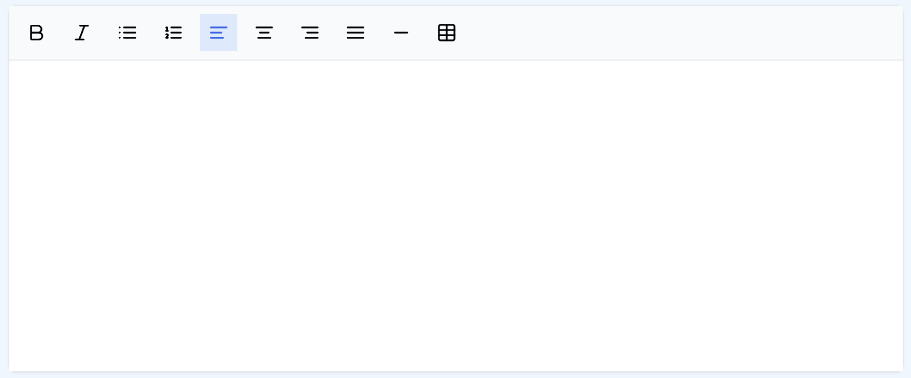

# LiteText

**LiteText** is a lightweight, user-friendly rich text editor built specifically for React applications. Designed to offer essential text formatting capabilities without the bulk of traditional editors, LiteText stands out for its simplicity and ease of integration. With only one peer dependency – **Tailwind CSS** – it’s perfect for projects where maintaining a minimal footprint is key.

Currently, LiteText supports a range of essential formatting tools, such as bold, italic, lists, table insertion, and horizontal rules. While still a work in progress, LiteText aims to evolve as a powerful and streamlined editor for modern web applications. Key features, like image and link insertion, are on the roadmap to provide even greater flexibility and interactivity in the near future.

## Shot



## Installation

To use the editor, make sure you have `react`, `lucide-react`, and `tailwindcss` installed:

```bash
npm install my-rich-text-editor react lucide-react tailwindcss
```

## Demo

a demo can be seen [on my project demo site](https://micheg.altervista.org/editordemo/).